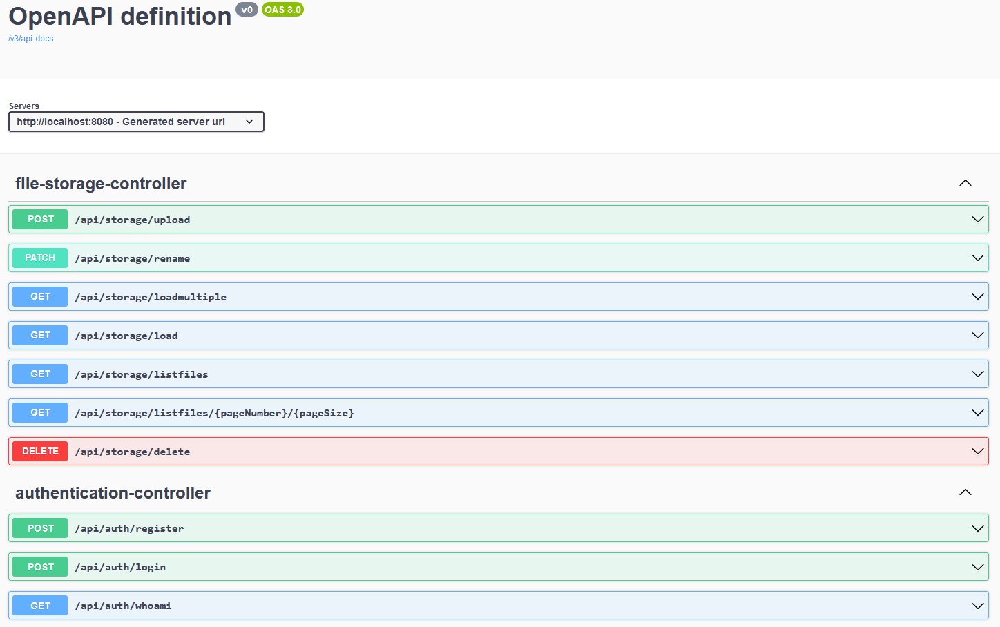

# MiniDrive

MiniDrive is a simple REST API that works similarly to cloud services like Google Drive or Dropbox.

Application uses:
- Spring Boot
- Spring Security with my own implementation of JWT Authentication
- Liquibase
- Lombok
- For tests, Mockito and Rest Assured

## Requirements

After cloning the repository make sure that you have following applications installed:

- Docker
- docker-compose
- JDK 17 or higher
- Gradle

Alternatively, you can provide your own Postgres database instead of the that was included as a docker-compose stack, then Docker tools are not required.

## How to run

*If you want to use it on any sort of server exposed to the internet I strongly encourage you to check all application.yml properties and changing any secrets, passwords and storage locations. Database credentials can be changed in docker/prod/docker-compose.yml directory*

*PGAdmin is available in dev docker-compose config at http://localhost:5050/, credentials can be found in docker/dev/docker-compose.yml*

Steps to run the application:

1. Clone the repository
2. Navigate to docker/prod
3. Run `docker compose up -d`, this will take some time on the first run. Subsequent runs will be faster.
4. Application is available on port 8080

For development - by default dev config is used, as long as you start docker-compose file from docker/dev you should be able to run the application via `gradle bootRun` command or an IDE of your choice without additional configuration on your end.

## API endpoints

Application comes with Swagger UI available at http://localhost:8080/swagger-ui/index.html *(assuming default configuration was used)*

File Insomnia_Collection is a collection exported from Insomnia which is an alternative to Postman which does not offer scratchpad/collections in free version anymore. Feel free to import it to your application or simply open it - data is stored in JSON and should be decently readable.

A preview of available endpoints can be seen below:

